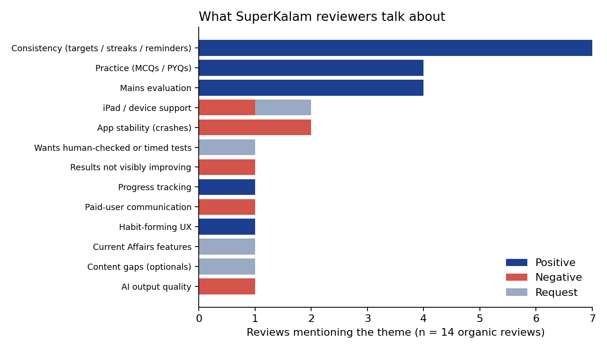

# Comeback Mode: protecting SuperKalam's consistency engine on the day it breaks

**Author:** Pratiksh Pandita  
**Status:** Concept and working prototype, pending validation with aspirants  
**Prototype:** https://superkalam-comeback.vercel.app/  
**Data and queries:** `/data` (review dataset and SQL), `/analytics` (PostHog queries)

## TL;DR

Half of the organic reviews I analysed credit SuperKalam's daily targets, streaks and reminders for keeping them consistent, and none criticise them. That makes consistency the product's strongest retention engine. Its weakest moment is the day a user misses their target. I propose **Comeback Mode**: a missed day pauses the streak instead of resetting it, and a short, AI-built plan based on the missed lesson lets the user earn it back. The primary metric is the 48-hour comeback rate after a missed day.

## 1. What I looked at

**Public product data (as of 25 Sep 2026)**
- **Play Store:** 4.7 stars from 756 reviews, 100K+ downloads.
- **App Store:** 4.5 stars from 166 ratings.
- **Scale claimed by SuperKalam:** 200K+ to 400K+ aspirants.
- **Onboarding (per the website FAQ):** pick a target exam year, get a learning path, then build a daily habit of one Mains answer and one MCQ topic.
- **Monetisation:** the free plan allows 2 doubt queries and 15 MCQs a day, and 3 Mains evaluations a month. The SUPER plan (₹7,499 until Mains) removes the limits. The FOCUS batch adds 1-on-1 mentorship from teachers on WhatsApp.
- **Language:** English only for now, with Indian languages announced.

**Reviews**
- 14 organic reviews: 10 from the App Store, 3 from Google Play, 1 Play review quoted on AppBrain.
- Each review is paraphrased and coded by theme and polarity in `data/reviews.csv` and `data/review_themes.csv`. The analysis is in `data/analysis.sql`.
- I excluded the testimonials on superkalam.com because the company picked them.

**Limits**
- 14 reviews is a small, self-selected sample. Treat the percentages as directional.
- Reddit threads did not surface through the search tools I used. Interviews with aspirants replace that source (see section 8).
- I have no access to SuperKalam's product data.

## 2. What users value

| Theme | Share of reviews | Tone |
|---|---|---|
| Consistency (daily targets, streaks, reminders) | 7 of 14 (50%) | All positive |
| Mains answer evaluation | 4 of 14 (29%) | All positive |
| Practice (MCQs, PYQs) | 4 of 14 (29%) | All positive |
| App stability (crashes) | 2 of 14 (14%) | Negative |
| iPad support | 2 of 14 (14%) | Negative or request |
| AI output quality, content gaps, Current Affairs features, paid-user communication, "results not improving", human-checked tests | 1 each | Negative or request |

**Three things stand out:**
1. **Consistency is the product.** The most common praise is not about content; it is about being kept on track. Reviewers describe the daily target, the streak and the nudges as an accountability partner.
2. **Criticism is scattered.** No single complaint dominates. Stability is the most repeated negative theme.
3. **Reviews can't show the most important failure.** App-store reviewers are, by definition, people who stayed. The aspirant who broke a streak and quietly stopped opening the app does not write a review. One reviewer notes that streaks are hard to build, which is the closest the data gets. The question that matters most for the consistency engine therefore needs product data and conversations with lapsed users, not more reviews.

## 3. The problem

UPSC preparation runs for many months, often alongside college or a job; SuperKalam's own FAQ speaks to working professionals. Missed days are guaranteed. If a missed day wipes a streak to zero, the product's strongest motivator turns into a reason to stop. The visible progress is gone, and "I've already broken it" becomes the excuse to skip tomorrow too. Behavioural research calls this the "what-the-hell effect": after breaking a goal, people tend to abandon it rather than resume.

**Hypothesis:** users who miss one daily target are much less likely to return within 48 hours than users on an unbroken streak. A recovery path that keeps the streak alive, but has to be earned, will raise the 48-hour comeback rate without making people miss more often.

**Open question to verify first:** SuperKalam's public help pages do not describe what happens when a daily target is missed (reset, grace period or freeze), so I have not yet confirmed it. This is step 1 of the validation plan. If a freeze already exists, the proposal narrows to the adaptive plan and the reason-based adjustments.

## 4. Proposed solution: Comeback Mode

**Principles**
- **Paused, not lost.** A missed day pauses the streak for 24 hours instead of resetting it.
- **Earned, not free.** The streak survives only if the user completes a short comeback.
- **Adaptive.** The plan and tomorrow's target respond to why the day was missed.
- **Scarce.** One comeback per 7 days, so the streak still means something.

**Flow**
1. **Missed-day screen.** The study register shows yesterday as "paused", not crossed out: "Your 12-day streak is paused, not lost."
2. **One-tap reason.** Work or college ran late, unwell, the syllabus felt like too much, just forgot, or something else.
3. **AI-built comeback plan.** The user picks 10, 15 or 20 minutes. The plan is 5 MCQs on the missed lesson, plus one short Mains answer for the longer options.
4. **Streak kept.** On completion, yesterday is marked "kept", not "studied", so the register stays honest, and today counts as a study day.
5. **Tomorrow adapts.** Late work moves the target to the evening slot. Feeling unwell or overwhelmed halves the target and starts with a strong topic. Forgetting prompts a daily reminder time.

**Where the AI fits.** SuperKalam's mentor already knows the missed lesson and the user's weak areas. It can weight the MCQs towards weak sub-topics and pick a PYQ-style Mains question. To avoid the "out of syllabus" issue one reviewer raised, questions should come from the vetted bank and PYQs rather than free generation. In the prototype this step is rule-based.

**Plan-specific rules.**
- **Free users:** a free user gets only 3 Mains evaluations a month. A comeback should never cost one of them, so free users either get an MCQ-only comeback (5 MCQs fits inside the 15-a-day limit) or the comeback answer is evaluated outside the quota.
- **FOCUS batch users:** they already have a human mentor on WhatsApp. For them, the missed-day reason is shared with the mentor, so the mentor's nudge is informed rather than generic.

**Out of scope:** paid streak repair, social or leaderboard mechanics, changes to the daily-target algorithm itself.

## 5. Success metrics

| Type | Metric |
|---|---|
| Primary | 48-hour comeback rate: share of users who miss a daily target and complete a study session within 48 hours |
| Secondary | D7 and D30 retention of users who missed a day; weekly active study days per user; free-to-paid conversion among users who used a comeback |
| Guardrails | Overall daily-target completion rate (people should not miss more because a safety net exists); comebacks per user; notification opt-out rate; crash-free sessions |

## 6. Experiment design

- **Population:** users who miss a daily target after a streak of at least 3 days.
- **Split:** 50/50 at the moment of the miss, with control keeping today's behaviour.
- **Size:** assuming a 40% baseline comeback rate, detecting a 5-point lift at 80% power and 5% significance needs about 1,540 users per arm. The baseline is an assumption, so replace it with the real number first.
- **Duration:** 2–4 weeks, or until the sample is reached.
- **Ship rule:** the primary metric improves and no guardrail gets worse.

## 7. Prototype

The prototype is a working, mobile-first web app with two versions, assigned at random to each tester:
- **Current flow:** a missed day resets the streak to zero.
- **Comeback Mode:** the full flow from section 4.

Every step fires a PostHog event: `missed_day_viewed`, `intent_today_rated`, `session_started`, `comeback_reason_selected`, `comeback_plan_confirmed`, `mcq_answered`, `mcq_set_completed`, `mains_submitted` or `mains_skipped`, `session_completed`, `streak_restored` and `intent_tomorrow_rated`. Each event carries the version, so the two can be compared in SQL (`analytics/posthog_queries.sql`).

It measures two things:
- whether people start and finish a session after seeing the missed-day screen;
- how likely they say they are to study today and tomorrow, on a 1–5 scale.

With 20–30 testers the result is directional, not proof.

## 8. Validation plan

- [ ] Use SuperKalam for 3–4 days as a new aspirant and confirm how a missed day is handled today.
- [ ] Interview 6–8 UPSC aspirants, at least 3 of whom stopped using a prep app, about the last time they broke a streak.
- [ ] Run the prototype with 20–30 aspirants and add the results below.

**Results:** _to be added after the test (n = __ per version)._

## 9. Other problems worth solving

1. **Stability.** Crashes appear in 2 of the 7 reviews that contain any criticism, including one from this month. A crash during a daily target breaks the same consistency loop, so crash-free sessions belong in the guardrails above.
2. **Trust in AI evaluation.** Explain each score against the four published criteria. One reviewer asked for timed tests checked by a person, which suggests a paid human re-check add-on as a conversion lever.
3. **Paid test-series communication.** A paying user complained about not being told when a test series was updated. Scheduled tests should come with calendar invites and reminders by default. This is a quick win.
4. **"Am I improving?"** A paid member said their schedule was good but their results weren't improving. Progress screens should show outcome trends (evaluation scores, topic accuracy over time), not just activity.

## 10. Risks

- **Streak devaluation.** Mitigated by requiring effort, allowing one comeback per 7 days, and marking yesterday "kept" rather than studied.
- **Already built.** SuperKalam may already have a freeze or grace period. That gets checked first, and the proposal narrows if so.
- **Notification fatigue.** The reason-based reminders replace generic nudges rather than adding to them.
- **AI plan quality.** Questions come from the vetted bank and PYQs, not open generation.

## Sources

- Google Play listing: https://play.google.com/store/apps/details?id=com.superkalam
- App Store listing and reviews: https://apps.apple.com/in/app/superkalam-crack-upsc-ias/id6747128599
- AppBrain listing: https://www.appbrain.com/app/superkalam-crack-upsc-ias/com.superkalam
- SuperKalam website and FAQ: https://superkalam.com/
- SuperKalam Help & Support (plan limits, FOCUS batch): https://superkalam.com/help-and-support
- Y Combinator company page: https://www.ycombinator.com/companies/superkalam
